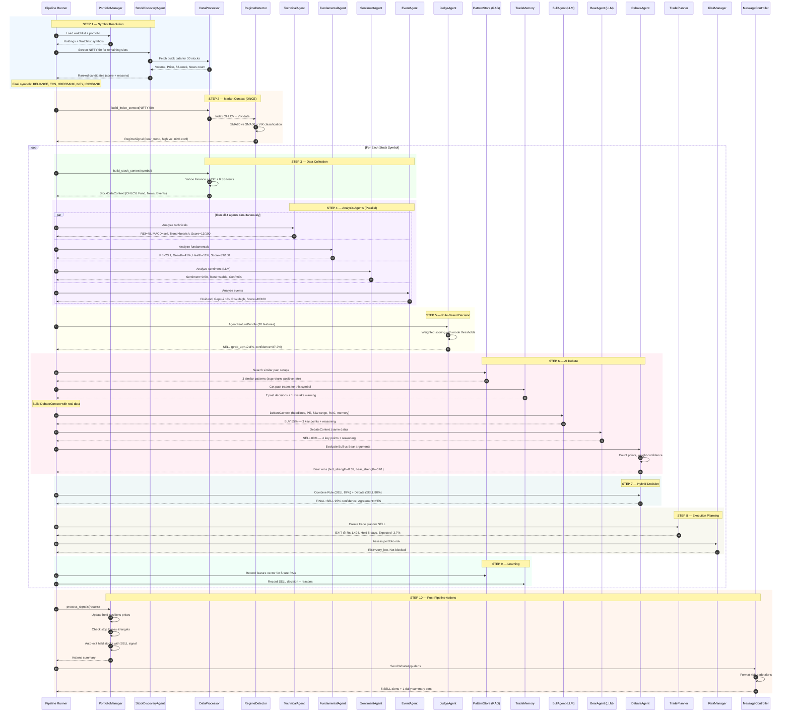
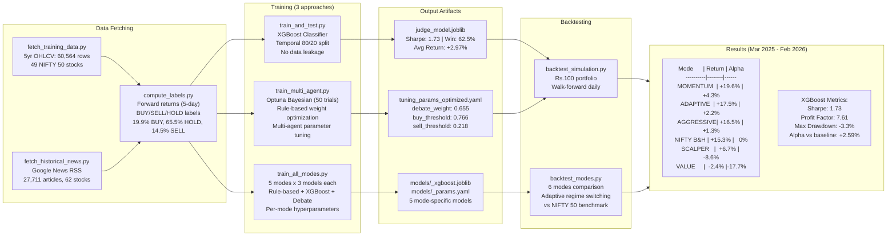
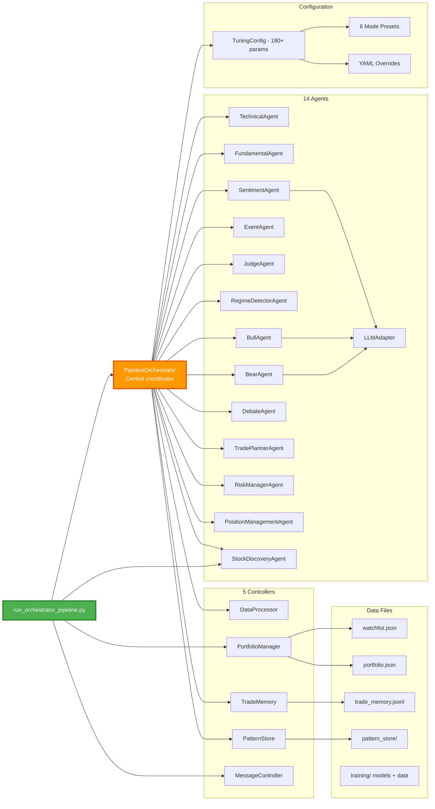
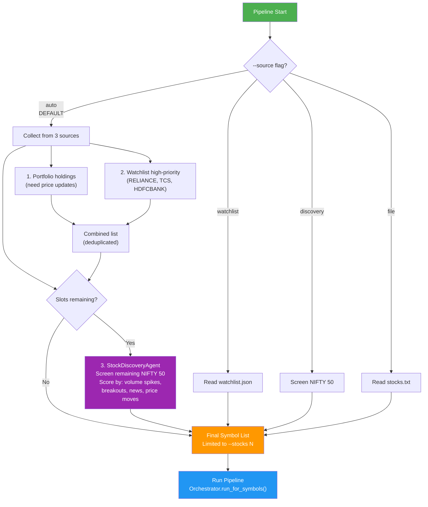
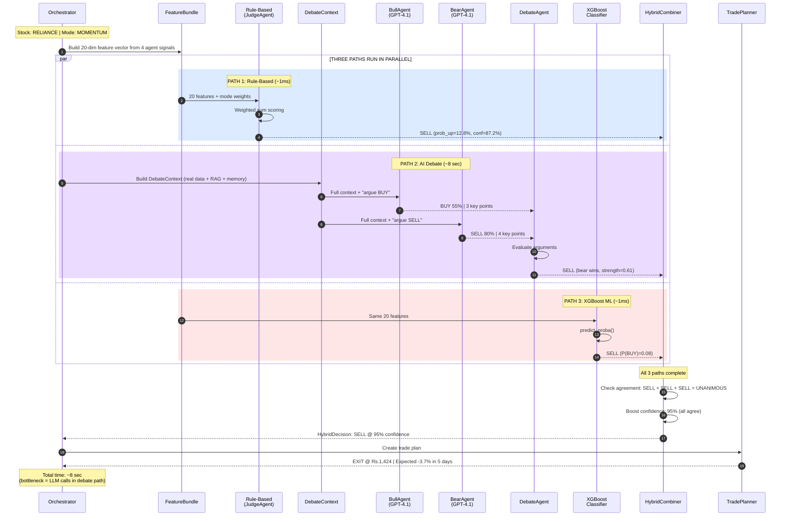

# LCF Architecture — Complete Mermaid Diagrams

## 1. End-to-End System Flow

```mermaid
flowchart TB
    subgraph ENTRY["ENTRY POINT"]
        CLI["run_orchestrator_pipeline.py<br/>--mode momentum<br/>--source auto<br/>--stocks 5<br/>--auto-trade<br/>--whatsapp +91XXX<br/>--show-portfolio"]
    end

    subgraph CONFIG["CONFIGURATION LAYER"]
        TP["TuningParams<br/>180+ parameters<br/>10 agent categories"]
        MODES["6 Trading Modes<br/>conservative | aggressive<br/>momentum | value<br/>scalper | adaptive"]
        YAML["tuning_params.yaml<br/>+ tuning_params_optimized.yaml"]
        MODES --> TP
        YAML --> TP
    end

    subgraph PERSISTENCE["PERSISTENT STORAGE"]
        WL[("watchlist.json<br/>10 stocks, priority levels<br/>last_signal tracking")]
        PF[("portfolio.json<br/>Holdings, Cash Rs.10L<br/>Trade History, P&L")]
        PS[("PatternStore<br/>vectors.npz + records.jsonl<br/>NumPy cosine similarity")]
        TM[("trade_memory.jsonl<br/>Append-only decisions<br/>Outcomes + Mistakes")]
        MODELS[("models/<br/>XGBoost per-mode<br/>Optimized weights")]
    end

    subgraph DATA_SOURCES["EXTERNAL DATA SOURCES"]
        YF["Yahoo Finance API<br/>OHLCV, Fundamentals<br/>Balance Sheet, Analyst"]
        NSE["NSE Corporate<br/>Corporate Events<br/>Board Meetings"]
        RSS["Google News RSS<br/>Headlines per stock<br/>12-month history"]
        VIX["India VIX<br/>Volatility Index<br/>Fear gauge"]
    end

    subgraph SYMBOL_RESOLUTION["STEP 1: SYMBOL RESOLUTION"]
        direction LR
        SDA["StockDiscoveryAgent<br/>Screen NIFTY 50 universe<br/>Volume spikes, Breakouts<br/>News movers, 52-week extremes"]
        SR_LOGIC{"Source?"}
        SR_AUTO["AUTO mode<br/>1. Portfolio holdings<br/>2. Watchlist high-priority<br/>3. Discovery fills remaining"]
        SR_WL["WATCHLIST mode<br/>Top N from watchlist"]
        SR_DISC["DISCOVERY mode<br/>Screen full NIFTY 50"]
        SR_FILE["FILE mode<br/>Read stocks.txt"]
        SYMBOLS["Final Symbol List<br/>e.g. RELIANCE, TCS,<br/>HDFCBANK, INFY, ICICIBANK"]
    end

    subgraph ORCHESTRATOR["STEP 2: PIPELINE ORCHESTRATOR"]
        direction TB
        INIT["PipelineOrchestrator.__init__<br/>Load mode config<br/>Initialize 14 agents<br/>Connect PatternStore + TradeMemory"]

        subgraph DATA_LAYER["DATA COLLECTION"]
            DP["DataProcessor<br/>Multi-provider aggregation<br/>Yahoo + NSE + RSS"]
            IDX["build_index_context<br/>NIFTY 50 + VIX"]
            SDC["build_stock_context<br/>StockDataContext per symbol<br/>OHLCV + Fund + News + Events"]
        end

        subgraph REGIME_LAYER["MARKET REGIME DETECTION (once per run)"]
            RDA["RegimeDetectorAgent<br/>SMA20 vs SMA50 crossover<br/>VIX level classification"]
            RS["RegimeSignal<br/>bull_trend | bear_trend | sideways<br/>low | moderate | high volatility<br/>confidence %"]
        end

        subgraph ANALYSIS_LAYER["ANALYSIS AGENTS (per stock, parallel)"]
            TA["TechnicalAgent<br/>RSI (14-day)<br/>MACD signal<br/>Trend direction<br/>Breakout flag<br/>Support & Resistance<br/>Volatility %"]
            FA["FundamentalAgent<br/>PE Ratio & Forward PE<br/>Revenue Growth %<br/>Operating Margin<br/>ROE, D/E Ratio<br/>Valuation label<br/>Financial Health score"]
            SA["SentimentAgent<br/>LLM-powered (GPT-4.1)<br/>News headline analysis<br/>Positive/Negative count<br/>Sentiment trend<br/>Confidence score"]
            EA["EventAgent<br/>Earnings dates<br/>Dividends (ex-date, amount)<br/>Stock splits<br/>Price gaps detection<br/>Event risk level"]
        end

        subgraph DECISION_ENGINE["DECISION ENGINE (per stock)"]
            direction TB

            subgraph RULE_PATH["PATH 1: Rule-Based Scoring"]
                AFB["AgentFeatureBundle<br/>20 normalized features<br/>tech_score, fund_score<br/>sent_score, evt_score<br/>rsi, macd, trend, breakout<br/>valuation, growth, health<br/>+ similarity from RAG"]
                JA["JudgeAgent<br/>Weighted sum of features<br/>Mode-specific weights<br/>buy_threshold, sell_threshold"]
                JD["JudgeDecision<br/>decision: BUY/SELL/HOLD<br/>prob_up_5d: 0-1<br/>expected_return_5d<br/>confidence, position_size"]
            end

            subgraph DEBATE_PATH["PATH 2: AI Debate Flow"]
                DC["DebateContext<br/>Real price data + OHLC bars<br/>Actual PE ratios, headlines<br/>52-week high/low range<br/>Agent signal summaries<br/>Similar past setups (RAG)<br/>Past trade mistakes (Memory)"]
                BULL["BullAgent (LLM)<br/>Argues BUY case<br/>3-5 evidence-based points<br/>Confidence 0-100%<br/>Full reasoning paragraph"]
                BEAR["BearAgent (LLM)<br/>Argues SELL case<br/>3-5 evidence-based points<br/>Confidence 0-100%<br/>Full reasoning paragraph"]
                DA["DebateAgent<br/>Count arguments<br/>Weight by confidence<br/>Determine winner<br/>bull_strength vs bear_strength"]
                DD["DebateDecision<br/>winning_side: bull/bear/neutral<br/>confidence, reasoning"]
            end

            HC["HybridCombiner<br/>final = rule_weight * judge + debate_weight * debate<br/>Check agreement between paths<br/>Boost confidence if both agree"]
            HD["HybridDecision<br/>final_decision: BUY/SELL/HOLD<br/>final_confidence: 0-100%<br/>rule_decision + debate_decision<br/>agreement: true/false"]
        end

        subgraph EXECUTION_LAYER["EXECUTION PLANNING (BUY/SELL only)"]
            TPA["TradePlannerAgent<br/>Entry type: market/limit<br/>Entry price<br/>Stop Loss price & %<br/>Target price & %<br/>Risk:Reward ratio<br/>Position size %<br/>Suggested shares<br/>Hold period (days)<br/>Support & Resistance levels"]
            RMA["RiskManagerAgent<br/>Portfolio exposure check<br/>Regime risk multiplier<br/>Max positions check<br/>Per-stock risk level<br/>Trade blocking logic"]
            PMA["PositionManagementAgent<br/>Trailing stop monitoring<br/>Partial exit rules<br/>Time-based exit"]
        end
    end

    subgraph POST_PIPELINE["STEP 3: POST-PIPELINE ACTIONS"]
        direction TB

        subgraph PORTFOLIO_MGMT["PORTFOLIO MANAGEMENT"]
            PM["PortfolioManager<br/>process_signals()"]
            PM_UPDATE["Update prices for holdings"]
            PM_SL["Check stop losses"]
            PM_TGT["Check targets"]
            PM_EXIT["Auto-exit on SELL signal"]
            PM_ENTER["Auto-enter on BUY signal<br/>(if --auto-trade)"]
            PM_SUMMARY["portfolio_text_summary()<br/>Holdings, P&L, Watchlist"]
        end

        subgraph ALERTS["WHATSAPP ALERTS"]
            MC["MessageController<br/>pywhatkit automation"]
            MSG_TRADE["Trade Alert Message<br/>Stock, Price, Confidence<br/>Trade Plan (SL/Target/R:R)<br/>Technicals (RSI/MACD/Trend)<br/>Fundamentals (PE/Growth)<br/>AI Debate (Bull vs Bear)<br/>Final Verdict + Risk"]
            MSG_DAILY["Daily Summary Message<br/>BUY/SELL/HOLD counts<br/>Per-stock breakdown<br/>Market regime<br/>Confidence stats"]
            MSG_PORT["Portfolio Status<br/>Holdings, Unrealized P&L<br/>Closed trades, Win rate"]
        end

        SAVE["analysis_results.json<br/>Full results per stock"]
    end

    subgraph LEARNING["STEP 4: LEARNING LOOP"]
        REC_PS["PatternStore.record()<br/>Save 20-dim feature vector<br/>For future RAG similarity"]
        REC_TM["TradeMemory.record_decision()<br/>Save decision + reasons<br/>Track for outcome later"]
        FEEDBACK["Future runs use:<br/>- Similar past setups<br/>- Past mistakes<br/>- Outcome history"]
    end

    %% === CONNECTIONS ===

    %% Entry -> Config
    CLI --> SR_LOGIC
    TP --> INIT

    %% Symbol Resolution
    SR_LOGIC -->|auto| SR_AUTO
    SR_LOGIC -->|watchlist| SR_WL
    SR_LOGIC -->|discovery| SR_DISC
    SR_LOGIC -->|file| SR_FILE
    WL --> SR_AUTO
    PF --> SR_AUTO
    SDA --> SR_AUTO
    WL --> SR_WL
    SDA --> SR_DISC
    SR_AUTO --> SYMBOLS
    SR_WL --> SYMBOLS
    SR_DISC --> SYMBOLS
    SR_FILE --> SYMBOLS

    %% Discovery agent data
    YF --> SDA

    %% Orchestrator init
    SYMBOLS --> INIT
    INIT --> DP
    INIT --> RDA

    %% Data sources -> DataProcessor
    YF --> DP
    NSE --> DP
    RSS --> DP
    VIX --> DP

    %% Data flow
    DP --> IDX
    DP --> SDC
    IDX --> RDA
    RDA --> RS

    %% Analysis (parallel per stock)
    SDC --> TA
    SDC --> FA
    SDC --> SA
    SDC --> EA

    %% Signals -> Feature Bundle -> Judge
    TA -->|TechnicalSignal| AFB
    FA -->|FundamentalSignal| AFB
    SA -->|SentimentSignal| AFB
    EA -->|EventSignal| AFB
    AFB --> JA
    JA --> JD

    %% Debate Context enrichment
    RS --> DC
    SDC --> DC
    PS -.->|Similar past setups| DC
    TM -.->|Past trades & mistakes| DC

    %% Debate flow
    DC --> BULL
    DC --> BEAR
    BULL -->|BUY argument| DA
    BEAR -->|SELL argument| DA
    DA --> DD

    %% Hybrid combination
    JD --> HC
    DD --> HC
    HC --> HD

    %% Execution
    HD -->|BUY or SELL| TPA
    TPA --> RMA
    RMA --> PMA

    %% Learning loop
    AFB -.->|Record feature vector| REC_PS
    HD -.->|Record decision| REC_TM
    REC_PS -.-> PS
    REC_TM -.-> TM
    PS -.-> FEEDBACK
    TM -.-> FEEDBACK
    FEEDBACK -.-> DC

    %% Post-pipeline
    HD --> PM
    TPA --> PM
    RMA --> PM
    PM --> PM_UPDATE
    PM --> PM_SL
    PM --> PM_TGT
    PM --> PM_EXIT
    PM --> PM_ENTER
    PM --> PM_SUMMARY
    PM --> PF
    PM --> WL

    HD --> MC
    MC --> MSG_TRADE
    MC --> MSG_DAILY
    PM --> MSG_PORT

    HD --> SAVE

    %% Styling
    classDef agent fill:#4a90d9,stroke:#2c5f8a,color:#fff,stroke-width:2px
    classDef llm_agent fill:#7b68ee,stroke:#4a3aaa,color:#fff,stroke-width:2px
    classDef controller fill:#50c878,stroke:#2d8a4e,color:#fff,stroke-width:2px
    classDef storage fill:#f4a460,stroke:#c47832,color:#000,stroke-width:2px
    classDef config fill:#dda0dd,stroke:#aa6eaa,color:#000,stroke-width:2px
    classDef datasource fill:#87ceeb,stroke:#5a9bb5,color:#000,stroke-width:2px
    classDef output fill:#ff6b6b,stroke:#cc4444,color:#fff,stroke-width:2px
    classDef decision fill:#ffd700,stroke:#cca800,color:#000,stroke-width:2px
    classDef action fill:#98fb98,stroke:#5eb85e,color:#000,stroke-width:2px

    class TA,FA,EA,JA,RDA,TPA,RMA,PMA,SDA agent
    class SA,BULL,BEAR,DA llm_agent
    class DP,PM,MC controller
    class WL,PF,PS,TM,MODELS storage
    class TP,MODES,YAML config
    class YF,NSE,RSS,VIX datasource
    class MSG_TRADE,MSG_DAILY,MSG_PORT,SAVE output
    class JD,DD,HD,HC,AFB,DC,RS decision
    class PM_UPDATE,PM_SL,PM_TGT,PM_EXIT,PM_ENTER,PM_SUMMARY action
    class SR_AUTO,SR_WL,SR_DISC,SR_FILE,SYMBOLS action
```

## 2. Per-Stock Agent Pipeline (Sequence)

## 3. Training & Backtesting Pipeline

## 4. Component Integration Map

## 5. Symbol Resolution Decision Tree

## 6. Triple-Path Decision Engine (Rule-Based + AI Debate + XGBoost in Parallel)

```mermaid
flowchart TB
    subgraph INPUT["INPUT: Per-Stock Signals"]
        SDC["StockDataContext<br/>OHLCV, Fundamentals<br/>News, Events"]
        RS["RegimeSignal<br/>bear_trend | bull_trend<br/>volatility level"]

        subgraph AGENT_SIGNALS["4 Analysis Agent Outputs"]
            TS["TechnicalSignal<br/>RSI=48, MACD=sell<br/>Trend=bearish<br/>Breakout=no<br/>Support=1307, Res=1473<br/>Score: 13/100"]
            FS["FundamentalSignal<br/>PE=23.1, FwdPE=21.8<br/>Growth=41%, Health=11%<br/>Valuation=fair<br/>Score: 39/100"]
            SS["SentimentSignal<br/>Score=0.50, Trend=stable<br/>Positive=0, Negative=0<br/>Confidence=0%"]
            ES["EventSignal<br/>Dividend, Gap=-2.1%<br/>Risk=high<br/>Score: 40/100"]
        end
    end

    subgraph FEATURE_PREP["FEATURE PREPARATION"]
        AFB["AgentFeatureBundle<br/>20 normalized floats<br/>tech_score, tech_rsi, tech_macd<br/>tech_volatility, tech_breakout, tech_trend<br/>fund_score, fund_valuation, fund_growth, fund_health<br/>sent_score, sent_net_ratio, sent_trend, sent_confidence<br/>evt_score, evt_earnings, evt_risk, evt_gap_up, evt_gap_down<br/>+ similarity_avg_return (from RAG)"]
    end

    subgraph TRIPLE_PATH["THREE PARALLEL DECISION PATHS"]
        direction LR

        subgraph PATH1["PATH 1: RULE-BASED<br/>(Weighted Scoring)"]
            direction TB
            JA["JudgeAgent<br/>Weighted sum of 20 features"]
            JA_WEIGHTS["Mode-Specific Weights:<br/>tech: 0.30 | fund: 0.15<br/>sent: 0.10 | evt: 0.10<br/>macd: 0.10 | rsi: 0.08<br/>breakout: 0.08 | trend: 0.09"]
            JA_THRESH["Thresholds:<br/>BUY if prob > 0.60<br/>SELL if prob < 0.35<br/>else HOLD"]
            JD["Rule Decision<br/>SELL 87% confidence<br/>prob_up=12.8%<br/>expected_return=-3.7%"]
            JA --> JA_WEIGHTS --> JA_THRESH --> JD
        end

        subgraph PATH2["PATH 2: AI DEBATE<br/>(LLM Bull vs Bear)"]
            direction TB
            DC["DebateContext<br/>Real headlines, PE ratios<br/>52-week range, raw OHLC<br/>RAG similar setups<br/>Past trade mistakes"]
            BULL["BullAgent (GPT-4.1)<br/>BUY 55%<br/>+ Price rebounded +4.8%<br/>+ PE=23.1 is fair<br/>+ Stable sentiment"]
            BEAR["BearAgent (GPT-4.1)<br/>SELL 80%<br/>- MACD sell, bearish trend<br/>- D/E=35.65, thin margin<br/>- Bear regime, high vol<br/>- No positive catalysts"]
            DA["DebateAgent<br/>Bull strength: 0.39<br/>Bear strength: 0.61<br/>Winner: BEAR"]
            DD["Debate Decision<br/>SELL 80% confidence<br/>Bear wins with 4 points"]
            DC --> BULL & BEAR
            BULL & BEAR --> DA --> DD
        end

        subgraph PATH3["PATH 3: XGBOOST ML<br/>(Trained Classifier)"]
            direction TB
            XGB_IN["Same 20 features<br/>as AgentFeatureBundle"]
            XGB["XGBoost Model<br/>judge_model.joblib<br/>Trained on 48,216 rows<br/>Temporal split, no leakage"]
            XGB_METRICS["Training Metrics:<br/>Sharpe: 1.73<br/>Win Rate: 62.5%<br/>Profit Factor: 7.61"]
            XGB_OUT["ML Decision<br/>predict_proba()<br/>P(BUY)=0.08<br/>SELL with high certainty"]
            XGB_IN --> XGB --> XGB_OUT
            XGB_METRICS -.-> XGB
        end
    end

    subgraph META_COMBINER["META-COMBINER (Consensus Engine)"]
        direction TB
        VOTES["Vote Collection:<br/>Rule-Based: SELL (87%)<br/>AI Debate: SELL (80%)<br/>XGBoost ML: SELL (92%)"]
        AGREEMENT{"All 3 agree?"}
        AGR_YES["STRONG SIGNAL<br/>Boost confidence to 95%+<br/>Increase position size"]
        AGR_PARTIAL["2 of 3 agree<br/>Use majority with<br/>weighted average confidence"]
        AGR_NO["All disagree<br/>Default to HOLD<br/>Flag for manual review"]
        FINAL_DEC["Final HybridDecision<br/>SELL @ 95% confidence<br/>Agreement: 3/3 unanimous<br/>All paths confirmed bearish"]
    end

    subgraph EXECUTION["EXECUTION"]
        TP["TradePlannerAgent<br/>EXIT @ Rs.1,424<br/>Expected drop: -3.7%<br/>Hold: 5 days"]
        RM["RiskManagerAgent<br/>Risk: very_low<br/>Not blocked"]
        PM["PortfolioManager<br/>Auto-exit if holding<br/>Skip entry (SELL signal)"]
    end

    %% Input flow
    TS & FS & SS & ES --> AFB

    %% Feature bundle to all 3 paths
    AFB --> JA
    AFB --> XGB_IN
    SDC --> DC
    RS --> DC

    %% RAG & Memory feed debate
    PS[("PatternStore<br/>RAG")] -.->|Similar setups| DC
    TM[("TradeMemory")] -.->|Past mistakes| DC

    %% All 3 paths feed meta-combiner
    JD --> VOTES
    DD --> VOTES
    XGB_OUT --> VOTES

    VOTES --> AGREEMENT
    AGREEMENT -->|Yes, all 3| AGR_YES
    AGREEMENT -->|2 of 3| AGR_PARTIAL
    AGREEMENT -->|No consensus| AGR_NO
    AGR_YES --> FINAL_DEC
    AGR_PARTIAL --> FINAL_DEC
    AGR_NO --> FINAL_DEC

    %% To execution
    FINAL_DEC --> TP --> RM --> PM

    %% Learning
    FINAL_DEC -.->|Record| TM
    AFB -.->|Record vector| PS

    %% Styling
    classDef rule fill:#4a90d9,stroke:#2c5f8a,color:#fff,stroke-width:2px
    classDef debate fill:#7b68ee,stroke:#4a3aaa,color:#fff,stroke-width:2px
    classDef ml fill:#ff6347,stroke:#cc3322,color:#fff,stroke-width:2px
    classDef signal fill:#87ceeb,stroke:#5a9bb5,color:#000,stroke-width:1px
    classDef decision fill:#ffd700,stroke:#cca800,color:#000,stroke-width:2px
    classDef meta fill:#ff9800,stroke:#e65100,color:#fff,stroke-width:3px
    classDef exec fill:#50c878,stroke:#2d8a4e,color:#fff,stroke-width:2px
    classDef storage fill:#f4a460,stroke:#c47832,color:#000,stroke-width:2px
    classDef agree fill:#98fb98,stroke:#5eb85e,color:#000,stroke-width:2px

    

    class JA,JA_WEIGHTS,JA_THRESH rule
    class DC,BULL,BEAR,DA debate
    class XGB,XGB_IN,XGB_METRICS ml
    class TS,FS,SS,ES signal
    class JD,DD,XGB_OUT,FINAL_DEC decision
    class VOTES,AGREEMENT meta
    class TP,RM,PM exec
    class PS,TM storage
    class AGR_YES,AGR_PARTIAL,AGR_NO agree
```

## 7. Triple-Path Timing (Sequence Diagram)

