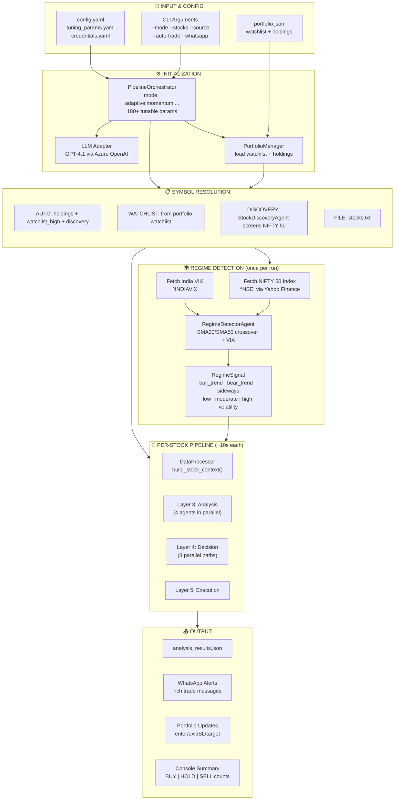
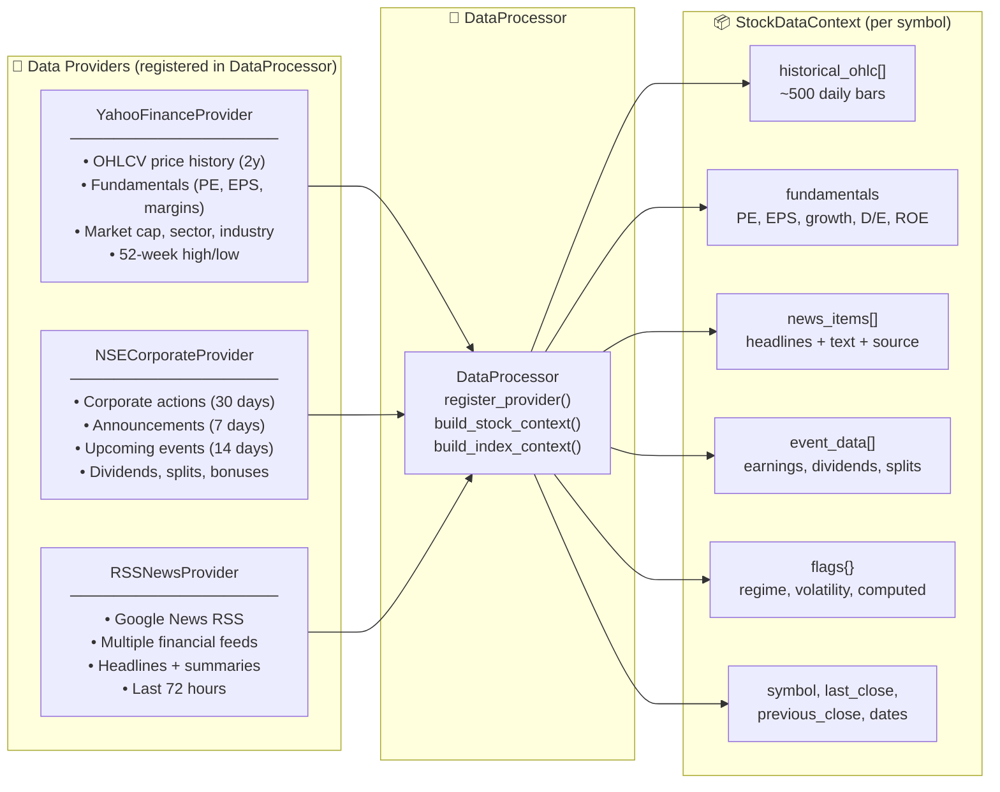
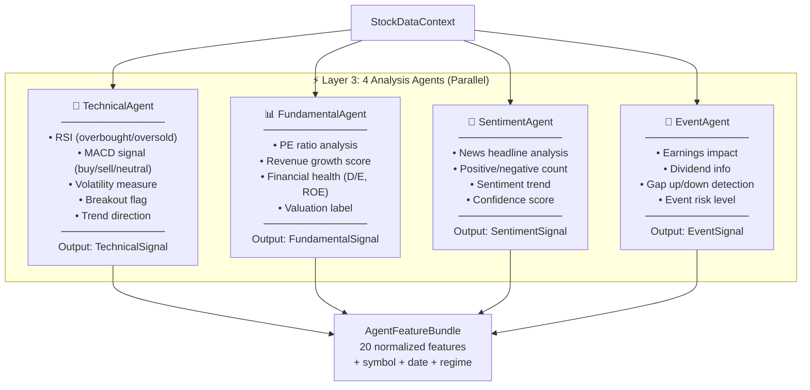
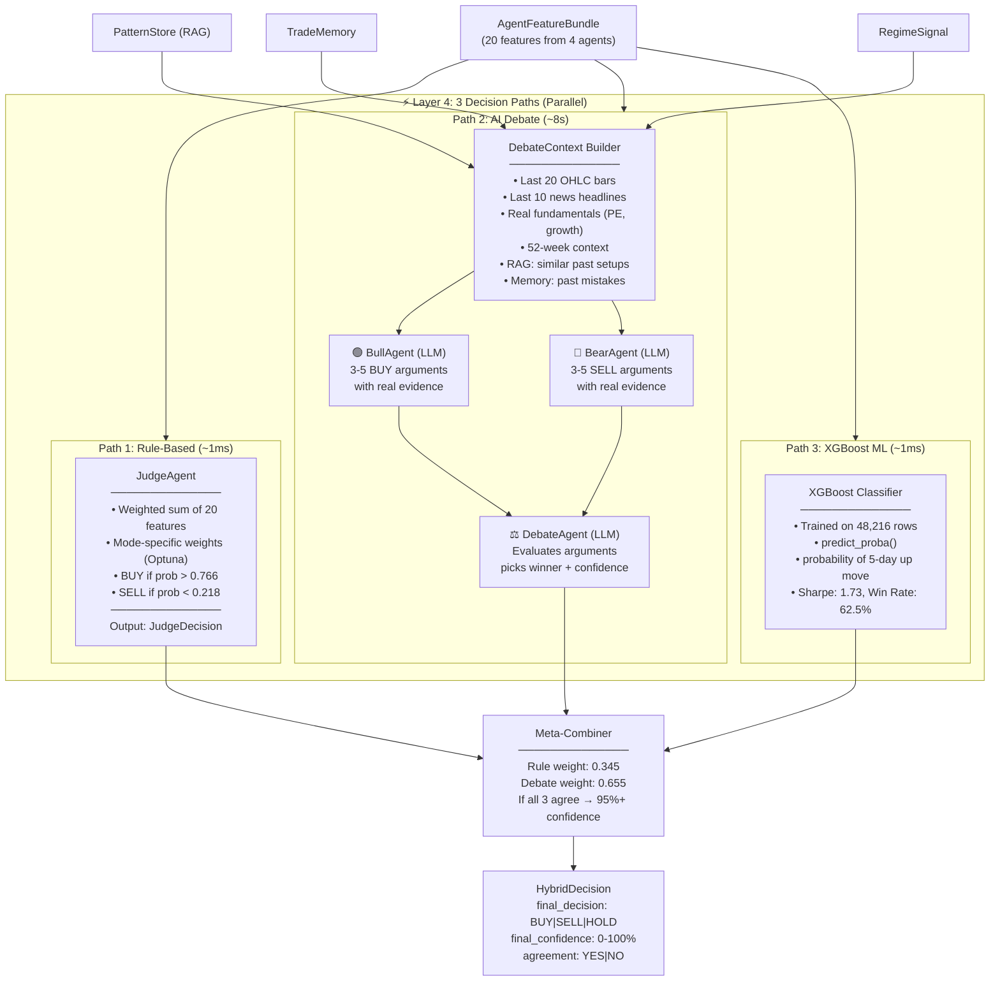
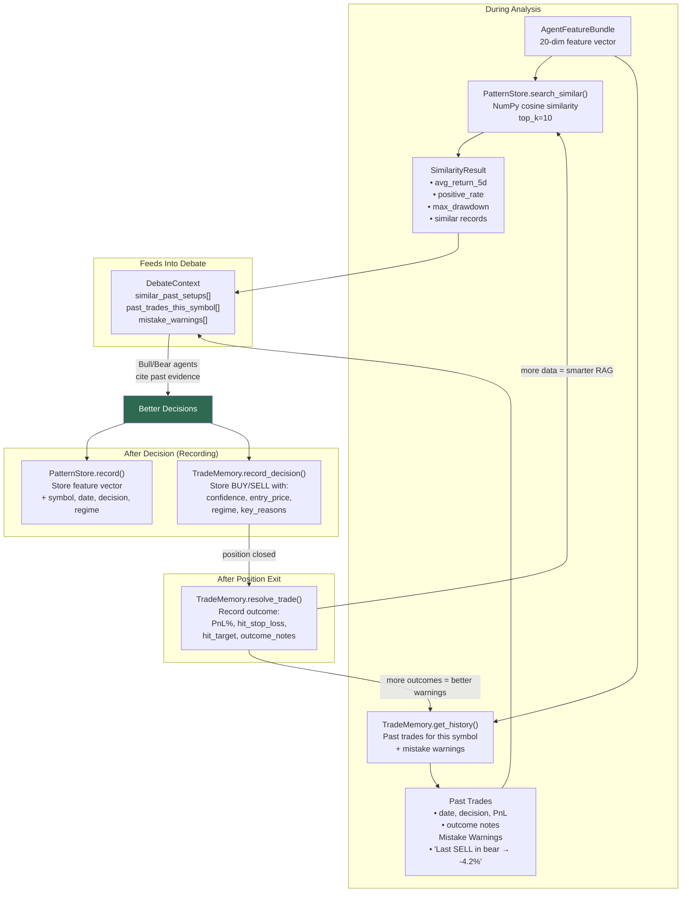
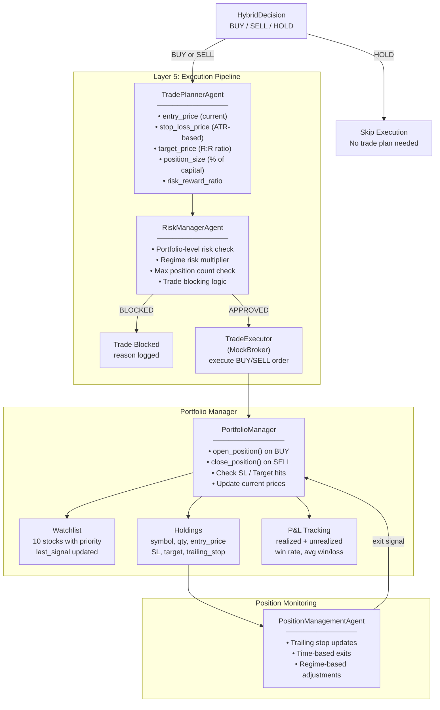
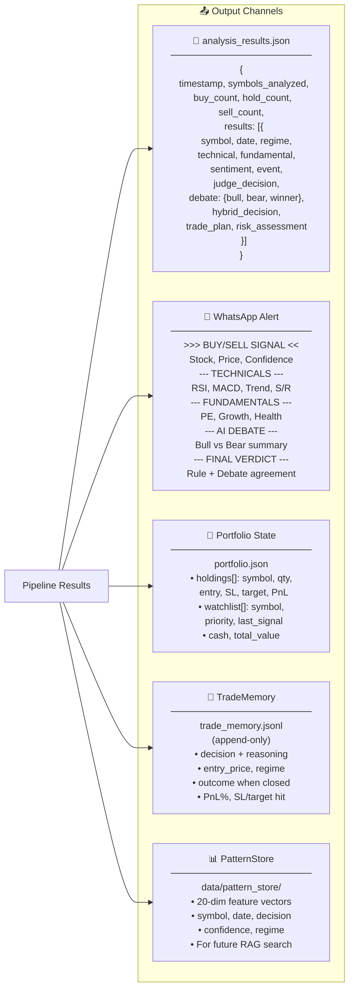
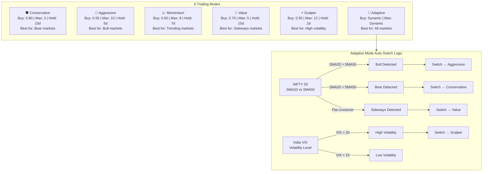
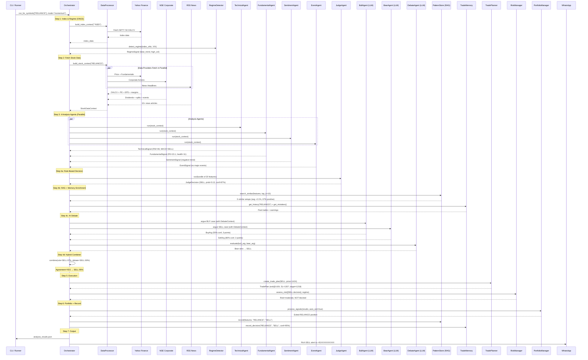

# LCF — Architecture & Flow Diagrams (Mermaid)

---

## 1. End-to-End Pipeline Overview

---

## 2. Data Ingestion Flow — Multi-Provider Architecture

---

## 3. Analysis Layer — 4 Agents in Parallel

---

## 4. Triple-Path Decision Engine (Parallel)

---

## 5. RAG + Memory Learning Loop

---

## 6. Execution & Portfolio Management Flow

---

## 7. Output Formats

---

## 8. 6 Trading Modes — Adaptive Switching

---

## 9. Complete Sequence — Single Stock Analysis

---

## 10. System Component Map

```mermaid
graph TB
    subgraph AGENTS["14 Agents"]
        A1["TechnicalAgent"]
        A2["FundamentalAgent"]
        A3["SentimentAgent"]
        A4["EventAgent"]
        A5["JudgeAgent"]
        A6["RegimeDetectorAgent"]
        A7["BullAgent 🟢"]
        A8["BearAgent 🔴"]
        A9["DebateAgent ⚖️"]
        A10["TradePlannerAgent"]
        A11["RiskManagerAgent"]
        A12["PositionManagementAgent"]
        A13["StockDiscoveryAgent"]
        A14["BacktestAgent"]
    end

    subgraph CONTROLLERS["5 Controllers"]
        C1["DataProcessor<br/>(multi-provider)"]
        C2["PortfolioManager<br/>(watchlist + holdings)"]
        C3["TradeExecutor<br/>(MockBroker)"]
        C4["PatternStore<br/>(RAG vector search)"]
        C5["TradeMemory<br/>(JSONL learning)"]
    end

    subgraph DATA_PROVIDERS["3 Data Providers"]
        P1["YahooFinanceProvider"]
        P2["NSECorporateProvider"]
        P3["RSSNewsProvider"]
    end

    subgraph EXTERNAL["External Services"]
        E1["Azure OpenAI<br/>GPT-4.1"]
        E2["Yahoo Finance API"]
        E3["NSE India"]
        E4["Google News RSS"]
        E5["WhatsApp Web<br/>(pywhatkit)"]
    end

    P1 --> E2
    P2 --> E3
    P3 --> E4
    A7 & A8 & A9 --> E1
    C3 --> E5

    style AGENTS fill:#1a365d,color:#fff
    style CONTROLLERS fill:#2d6a4f,color:#fff
    style DATA_PROVIDERS fill:#7c3aed,color:#fff
    style EXTERNAL fill:#92400e,color:#fff
```

